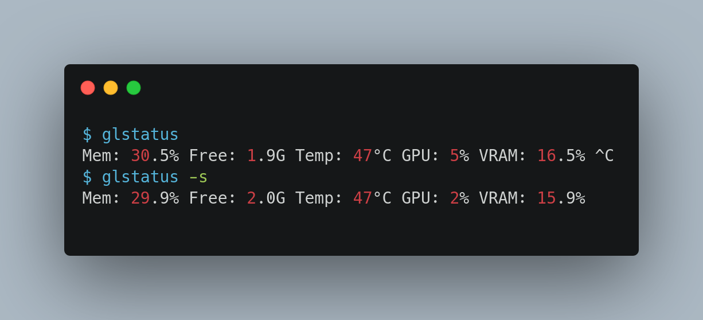

# glstatus

[](https://golang.org/)
[](LICENSE)

**glstatus** is a minimal system status monitor inspired by [slstatus](https://tools.suckless.org/slstatus/) from the suckless project. Written in Go, it provides real-time system statistics with a focus on GPU monitoring and Unix philosophy principles.



## Installation

### Requirements
- Go 1.24+
- Linux kernel 4.4+

### Build & Install
```bash
git clone https://github.com/Calebe94/glstatus.git
cd glstatus
make install  # Installs to /usr/local/bin
```

## Usage

### Basic Usage
```bash
glstatus  # Interactive mode (updates every second)
```

### Silent Mode (for status bars)
```bash
glstatus -s  # Single output then exit
```

### Example dwm Integration
```bash
while true; do
    xsetroot -name "$(glstatus -s)"
    sleep 1
done &
```

## Configuration

Edit `config.go` to modify modules:
```go
var modules = []Module{
    {Producer: components.RamPerc, Format: "Mem: %s ", Argument: ""},
    {Producer: components.GpuTemp, Format: "Temp: %s ", Argument: ""},
    // Add/remove components as needed
}
```

Available components:
- `RamPerc`: Memory usage percentage
- `RamFree`: Available memory in GB
- `GpuTemp`: GPU temperature
- `GpuPerc`: GPU utilization
- `GpuMemPerc`: VRAM usage

## Design Philosophy

### Inspired by slstatus
- **Compile-time configuration**: Components selected at build
- **Unix composability**: Plain text output for piping
- **Resource efficiency**: <1% CPU usage typical

## License

MIT License - See [LICENSE](LICENSE) for details
